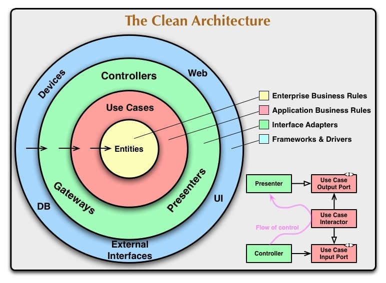

# Clean Architecture and Test Driven Development (TDD) using TypeScript


Clean Architecture is an architecture design developed by [Robert C. Martin (Uncle Bob)](https://blog.cleancoder.com/uncle-bob/2012/08/13/the-clean-architecture.html). You will find many tutorials talking about the theory and concepts behind Clean Architecture. How you choose to apply these concepts in your project is up to you. You will see in [this article](https://www.freecodecamp.org/news/a-quick-introduction-to-clean-architecture-990c014448d2/), some variations of this design.

With all these concepts, I wanted to provide a real-world example using best practices applying Clean Architecture.



## What does this example project do?

The application fetches number trivia from [Numbers API](http://numbersapi.com/#42) when connected to the internet (online). If the application detects a network connection is no longer present (offline), it will fetch the last trivia from local cache. You can fetch trivia from a number you provide or a random number provided by the API. Because the business logic independent of any presentation or frameworks, applications representing the presentation layer can be built using different UI framework and adapters. This project provides some concrete implementations using [React.js](https://reactjs.org/) and [Vue.js](https://vuejs.org/).


## What's inside?

This project was built using [Turborepo](https://turborepo.org/). This turborepo uses [pnpm](https://pnpm.io) as a package manager. It includes the following packages/apps:

### Apps and Packages

- `apps/react`: a [React.js](https://reactjs.org/) app
- `apps/vue`: a [Vue.js](https://vuejs.org/) app
- `apps/server`: a [Node.js](https://vuejs.org/) web service. [See Readme](./apps/api/README.md)
- `packages/business`: business logic demonstrating how to implement the `domain` and `data` layers of clean architecture.
- `packages/eslint-config-custom`: `eslint` configurations (includes `eslint-config-next` and `eslint-config-prettier`)
- `packages/tsconfig`: `tsconfig.json`s used throughout the monorepo

Each package/app is 100% [TypeScript](https://www.typescriptlang.org/).

## Presentation layer

### Web apps

To demonstrate a clean presentation layer, the web applications use [Shoelace](https://shoelace.style/), a web component library built on [Lit](https://lit.dev/). Developing web components is a best practice when you want to apply the DRY (Don't repeat yourself) principle.

### Server

Custom adapters were developed that leverage our business logic but meet the requirements needed by the server. [See Readme](./apps/api/README.md)

# Test Driven Development (TDD)

The demo is built using TDD ensuring all business logic passes and has coverage. Tests were built and tested using [Vitest](https://vitest.dev/). Vitest is built on top of [Jest](https://jestjs.io/). If you know Jest, you know Vitest. Vitest supports TypeScript by default. Here is a great overview video on Vitest: https://www.youtube.com/watch?v=7f-71kYhK00


# Getting Started

### Installing dependencies

To install all apps and packages dependencies, run the following command from the project root:

### Build

To build all apps and packages, run the following command:

```
pnpm run build
```

```
pnpm install
```
### Test

To test all apps and packages, run the following command:

```
pnpm run test
```

The test will be reported in the terminal and in HTML `packages/business/coverage/index.html`.

### Develop

To develop all apps and packages, run the following command:

```
pnpm run dev
```

### Utilities

This turborepo has some additional tools already setup for you:

- [TypeScript](https://www.typescriptlang.org/) for static type checking
- [ESLint](https://eslint.org/) for code linting
- [Prettier](https://prettier.io) for code formatting

### Tricks to discovered along the way...

1. In order to get the `business` package to work with the server and web applications, storage needed to be `async`. 
An important note when building things is its better to go async route initially to avoid reworking code later.

2. Getting the dev and build environments to play with each other was a real pain. The web apps use `vite` while the 
server uses just the TypeScript compiler. Neither the vite nor the TS docs helped with this issue. I did read thoroughly
this section in the Vite docs - https://vitejs.dev/guide/build.html#building-for-production. But what it really came
down to was that I had some luck with the compiling by placing this in the `vite.config.ts` file:

```js
optimizeDeps: {
  include: [
    "business",
  ],
},
build: {
  rollupOptions: {}
},
```

Notice that the build.rollupOptions just contains an empty object. I don't know why but this works along with the optimizeDeps.
I don't like that there are some unknowns there at the moment but the project will run and build all projects correctly.

# Roadmap

- [X] Provide a application example in React.
- [X] Provide a application example in Vue.
- [X] Provide a service example using Node.js.
- [ ] Provide a command line example that can be run from the terminal.
- [ ] Provide a desktop example using Electron.

## Credits

*This project is inspired by [Flutter](https://flutter.dev/) tutorials by [Matt Rešetár](https://resocoder.com/)*

## License

MIT license.